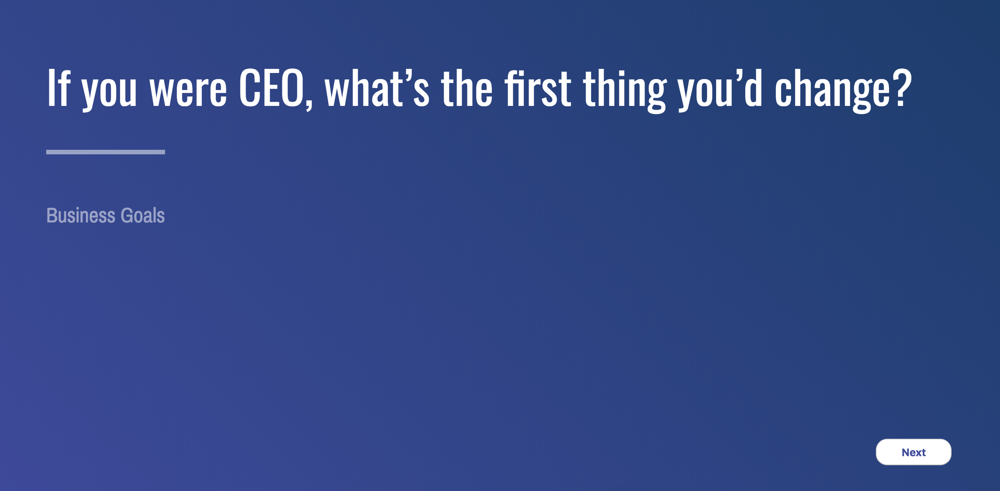

# Catchup Cue's



This has been created as a question prompt for leaders to ask during regular catchups (1 on 1's).

##### [Live Demo](https://lindsayjopson.github.io/catchup/)

They are set up with a bunch different areas of focus. Ranging from Self Improvement & Happiness to Long Term business & Management improvement questioning.

##### Questions contributors:
  * [Jason Evanish](https://twitter.com/evanish) post [101 Questions to Ask in One on Ones](https://jasonevanish.com/2014/05/29/101-questions-to-ask-in-1-on-1s/)
  * [Movio](http://www.movio.co)

#### Adding questions
Adding questions is totally extendible by editing the ```questions.js``` file.
Alternatively open a PR into this repo and I will be more then happy to merge!

### Installation
```
npm install
```

#### To build
```
npm run build
```

#### Run on local machine
```
npm start
```
